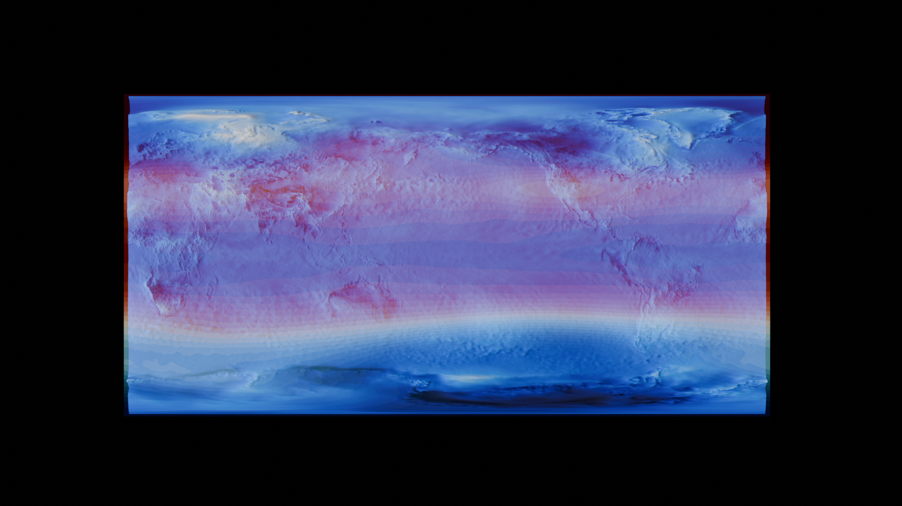
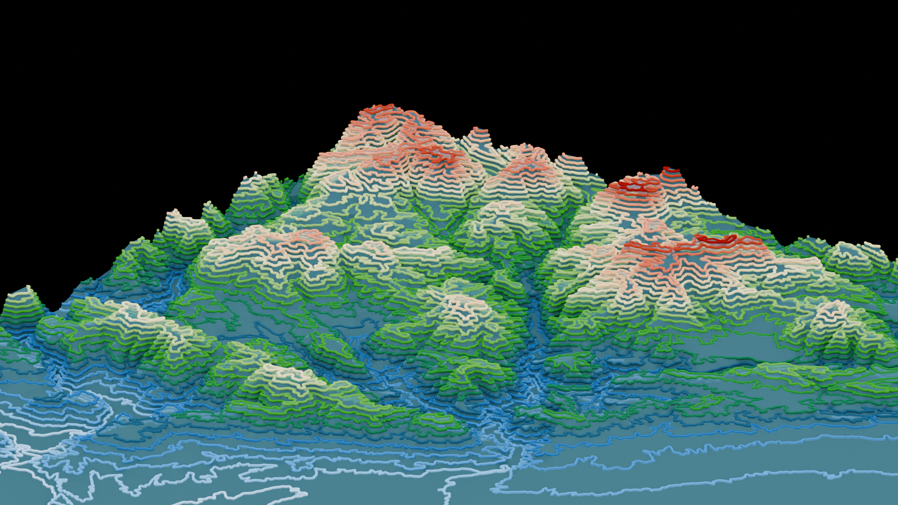

# SciBlend: Advanced Scientific Visualization for Blender v.2.3.0


SciBlend Advanced Core v.2.3.0 is a powerful add-on for Blender 4.2+ that represents a significant evolution from its predecessor, [SciBlend-Core](https://github.com/josemarinfarina/SciBlend-Core). This advanced version is characterized by its requirement for a more complex setup process, primarily due to the need to install VTK (Visualization Toolkit), netCDF4, and additional geospatial libraries within Blender's Python environment.

SciBlend bridges the gap between scientific data processing and high-quality 3D visualization. By integrating VTK, VTU, PVTU, NetCDF, and Shapefile capabilities directly into Blender, SciBlend allows researchers and scientists to create stunning, photorealistic visualizations of complex scientific and geospatial data.

Unlike SciBlend-Core, which primarily focused on importing data from Paraview, this advanced version offers deeper integration with scientific data formats through VTK, VTU, PVTU, NetCDF, and Shapefiles, allowing for more sophisticated data manipulations and visualizations directly within Blender. The addition of advanced geospatial features like Delaunay triangulation and terrain modeling makes it particularly powerful for working with geographic and topographic data.

## Table of Contents

1. [Features](#features)
2. [Requirements](#requirements)
3. [Installation](#installation)
   - [VTK and netCDF4 Installation](#vtk-and-netcdf4-installation)
   - [SciBlend Addon Installation](#sciblend-addon-installation)
4. [Usage](#usage)
   - [Importing VTK/VTU/PVTU Files](#importing-vtk/vtu/pvtu-files)
   - [Importing NetCDF Files](#importing-netcdf-files)
   - [Importing Shapefile (.shp) Files](#importing-shapefile-shp-files)
5. [Advanced Features](#advanced-features)
6. [Contributing](#contributing)
7. [Support](#support)

## Features

- **Comprehensive Format Support**: 
  - Import VTK (.vtk) files with legacy format support
  - Full support for XML UnstructuredGrid Format (.vtu)
  - Support for Parallel XML UnstructuredGrid Format (.pvtu)
  - Support for NetCDF (.nc) and NetCDF4 (.nc4) files
  - Support for Shapefiles (.shp) with advanced processing capabilities
  - Preserves complex scientific data structures and attributes

- **Advanced Cell Type Support**:
  - Basic Elements: Vertex, Line, Pixel, Triangle Strip, Quad, Polygon
  - 3D Elements: Tetrahedron, Hexahedron, Wedge, Pyramid, Voxel
  - Advanced Elements: Hexagonal Prism, Pentagonal Prism, Polyhedron
  - Linear Elements: Polyline, Poly-Vertex
  - Shapefile Elements: Points, Lines, Polygons with Delaunay triangulation

- **Data Attribute Processing**:
  - Automatic conversion of cell data to point data
  - Vector component separation (Magnitude, X, Y, Z)
  - Independent visualization of each data component
  - Automatic material generation for each attribute
  - Delaunay triangulation for terrain point clouds

- **Advanced Animation Support**: Create smooth animations from time-series data with automatic keyframing.
- **Dynamic Material Management**: Automatically generate and apply materials based on data attributes.
- **Geometry Organization**: Efficiently organize imported geometry into collections for better scene management.
- **Boolean Operations**: Perform advanced boolean operations for data analysis and visualization.
- **Customizable Import Settings**: Fine-tune import parameters such as scale, axis orientation, and frame range.
- **Advanced Visualization Options**:
  - Spherical Projection for global/planetary data when importing NetCDF files.
  - Adjustable sphere radius and height scaling
  - Support for both planar and spherical data representation
  - Automatic handling of latitude/longitude coordinates

## Requirements

- Blender 4.2 or higher

- Python 3.11 (bundled with Blender 4.2+)

- VTK 9.3.0 (installation instructions provided)

- netCDF4 (installation instructions provided)


## Installation

### VTK and netCDF4 Installation

Installing VTK and netCDF4 within Blender's Python environment is a crucial step. Follow these instructions carefully:

#### 1. Verify the Python Version in Blender:
First, ensure that Blender is using Python 3.11. Open Blender's Python Console and type:

```python
import sys
print(sys.version)
```

You should see an output like `Python 3.11.x`.

#### 2. Access Blender’s Python Environment:
Blender includes its own Python environment, so we need to install VTK within that specific environment.

In your system’s terminal (not Blender's console), navigate to where Blender is installed.

##### On Linux/macOS:
```bash
cd /path_to_blender/blender-4.2.1-linux-x64/4.2/python/bin
```

##### On Windows (Run in CMD or PowerShell):
```powershell
cd C:\path_to_blender\blender-4.2.1-windows64\4.2\python\bin
```

#### 3. Install VTK:

Once in the correct directory, you can install VTK using `pip`. Ensure that you’re installing a compatible version of VTK for Python 3.11.

##### Run the following command to install VTK:

```bash
./python3.11 -m pip install vtk==9.3.0
```

For Windows, the command will be:

```powershell
python3.11 -m pip install vtk==9.3.0
```

#### 4. Optional: Modify VTK Files to Fix Compatibility (In case of issues related to VTK Installation, very common if you have installed matplotlib in the Blender Python environment before):

After installing VTK, there may be some compatibility issues with certain imports that need to be addressed. We will modify some VTK Python files.

##### Edit `vtk.py`:

1. Open the `vtk.py` file located in Blender's Python environment:

   - On Linux/macOS:
     ```bash
     nano /path_to_blender/blender-4.2.1-linux-x64/4.2/python/lib/python3.11/site-packages/vtk.py
     ```

   - On Windows:
     Open the file at `C:\path_to_blender\blender-4.2.1-windows64\4.2\python\lib\python3.11\site-packages\vtk.py` using a text editor like Notepad.

2. Find the line that says:

   ```python
   from vtkmodules.vtkRenderingMatplotlib import *
   ```

3. Comment out this line by adding a `#` at the beginning:

   ```python
   # from vtkmodules.vtkRenderingMatplotlib import *
   ```

4. Save and close the file.

##### Edit `all.py`:

1. Similarly, open the `all.py` file located in the same directory:

   - On Linux/macOS:
     ```bash
     nano /path_to_blender/blender-4.2.1-linux-x64/4.2/python/lib/python3.11/site-packages/vtkmodules/all.py
     ```

   - On Windows:
     Open the file at `C:\path_to_blender\blender-4.2.1-windows64\4.2\python\lib\python3.11\site-packages\vtkmodules\all.py`.

2. Comment out the same line as before:

   ```python
   # from vtkmodules.vtkRenderingMatplotlib import *
   ```

3. Save and close the file.

#### 5. Install netCDF4:

After installing VTK, install netCDF4 using pip in the Blender Python environment:

##### On Linux/macOS:
```bash
  ./python3.11 -m pip install netCDF4
```

##### On Windows:
```powershell
python3.11 -m pip install netCDF4
```

#### 6. Install required dependencies for shapefile support:

After installing VTK and netCDF4, install the following packages using pip in the Blender Python environment:

##### On Linux/macOS:
```bash
./python3.11 -m pip install geopandas
./python3.11 -m pip install pytz
./python3.11 -m pip install shapely
./python3.11 -m pip install fiona
```

##### On Windows:
```powershell
python3.11 -m pip install geopandas
python3.11 -m pip install pytz
python3.11 -m pip install shapely
python3.11 -m pip install fiona
```


### SciBlend Addon Installation

1. Download the SciBlend zip file from the releases page.
2. In Blender, go to Edit > Preferences > Add-ons.
3. Click "Install" and select the downloaded zip file.
4. Enable the SciBlend addon by checking the box next to it.

## Usage


### Importing VTK/VTU/PVTU Files

When working with VTK files:
1. Use the "Import VTK Animation" option in the SciBlend panel
2. Select your file(s):
   - For .vtk files: Select your legacy VTK files
   - For .vtu files: Select all XML UnstructuredGrid files
   - For .pvtu files: Select all Parallel XML UnstructuredGrid files
3. Configure import settings:
   - Set frame range for animations
   - Adjust scale factor if needed
   - Configure axis orientation
   - Set up material options

For animation sequences:
1. Select all files in your time series (e.g., time_0.vtu, time_1.vtu, time_2.vtu)
2. Ensure files are properly numbered for correct sequence order
3. The addon will automatically:
   - Create keyframes for animation
   - Handle timing between frames
   - Organize files in sequential order

The data will be automatically:
- Converted to appropriate mesh formats
- Mapped to materials based on data attributes
- Organized into frame collections for time-series data
- Handled for missing or invalid data


### Importing NetCDF Files

When working with NetCDF files:
1. Use the "Import NetCDF Animation" option in the SciBlend panel
2. Select your .nc or .nc4 file
3. Configure import settings:
   - Choose the variable to visualize
   - Set time dimension name (default: "time")
   - Adjust scale factor if needed
   - Configure axis orientation

For global or planetary data visualization:
1. Enable "Spherical Projection" in the import settings
2. Adjust "Sphere Radius" to set the base size of the sphere (default: 1.0)
3. Use "Height Scale" to control the intensity of elevation changes (default: 0.01)
   - Lower values (0.001-0.01) for subtle elevation changes
   - Higher values (0.01-0.1) for more pronounced elevation differences

The data will be automatically:
- Mapped to colors using a customizable color ramp
- Organized into frame collections for time-series data
- Projected onto a sphere when using spherical projection
- Handled for missing values (NaN) and invalid data

Note: When using spherical projection, latitude/longitude coordinates will be automatically converted to 3D coordinates on the sphere's surface.

Note: The import process may take some time depending on the size 
and number of files in your sequence.



### Importing Shapefile (.shp) Files

When working with Shapefile (.shp) data:
1. Use the "Import Shapefile" option in the SciBlend panel
2. Select your .shp file
3. Configure import settings:
   - Adjust scale factor if needed
   - Configure axis orientation
   - Set up material options

For terrain and point cloud data:
1. Select the imported mesh object(s)
2. Use the "Apply Delaunay" option to create a triangulated surface
3. The addon will automatically:
   - Process and remove duplicate points
   - Handle z-colinear points
   - Create a TIN (Triangulated Irregular Network) mesh
   - Preserve original materials and attributes

The Delaunay triangulation feature supports:
- Native Blender CDT (Constrained Delaunay Triangulation) when available
- Custom triangulation algorithm as fallback
- Automatic handling of duplicate vertices
- Material transfer from source objects




## Advanced Features

- **Automatic Material Generation**: SciBlend creates materials based on VTK data attributes, allowing for immediate visualization of scalar fields.
- **Frame-by-Frame Geometry Management**: Imported geometries are organized into frame-specific collections for easy management of time-series data.
- **Dynamic Boolean Operations**: Perform real-time boolean operations on your data for advanced analysis and visualization techniques.

## Contributing

Contributions are welcome! Feel free to open issues or submit pull requests to improve this project.

## Support

For questions, issues, or feature requests, please use the GitHub issue tracker or contact the maintainer at info@sciblend.com.
